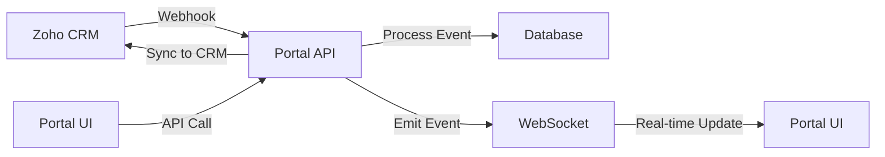

# System Patterns

## Database Architecture

### Supabase Database Structure
The system uses Supabase PostgreSQL with comprehensive Row Level Security (RLS) and automated triggers:

**Core Tables (7 total):**
- `partners` - Partner company information with Zoho CRM integration
- `users` - User accounts for partners and sub-accounts  
- `leads` - Lead information with Zoho CRM synchronization
- `lead_status_history` - Audit trail for lead status changes
- `activity_log` - System-wide activity and audit logging
- `user_sessions` - JWT session management and refresh tokens
- `notifications` - User notifications and alerts

### Database Security Patterns

#### Row Level Security (RLS) Implementation
All tables have RLS enabled with 28 comprehensive policies:

```sql
-- Example: Partner data isolation
CREATE POLICY "Partners can view own data" ON partners
    FOR SELECT USING (
        auth.uid()::text IN (
            SELECT id::text FROM users WHERE partner_id = partners.id
        )
    );

-- Example: Multi-tenant lead access
CREATE POLICY "Users can view partner leads" ON leads
    FOR SELECT USING (
        auth.uid()::text IN (
            SELECT u.id::text FROM users u 
            WHERE u.role = 'admin'
        ) OR -- Admins can see all
        partner_id IN (
            SELECT u.partner_id FROM users u WHERE u.id::text = auth.uid()::text
        ) -- Same partner organization
    );
```

#### Access Control Patterns
- **Partner Isolation**: Each partner organization can only access their own data
- **Role-Based Access**: Admin users have elevated permissions across all data
- **Sub-Account Management**: Partners can create and manage sub-accounts within their organization
- **Lead Scoping**: Users can only view/modify leads belonging to their partner organization

### Database Function Patterns

#### Utility Functions (11 total)
```sql
-- Partner statistics aggregation
CREATE FUNCTION get_partner_stats(partner_uuid UUID) RETURNS JSONB
-- Activity logging helper
CREATE FUNCTION log_activity(entity_type, entity_id, action, ...) RETURNS UUID
-- Lead status history tracking
CREATE FUNCTION create_lead_status_history(lead_id, old_status, new_status, ...) RETURNS UUID
-- User-partner relationship info
CREATE FUNCTION get_user_partner_info(user_id UUID) RETURNS JSONB
-- Access control validation
CREATE FUNCTION can_user_access_lead(user_id UUID, lead_id UUID) RETURNS BOOLEAN
```

#### Automated Triggers (6 total)
- **Timestamp Updates**: Auto-update `updated_at` fields on record modifications
- **Activity Logging**: Automatic logging for lead creation, status changes, and user logins
- **Audit Trail**: Complete tracking of lead status history with user attribution

### Performance Optimization Patterns

#### Comprehensive Indexing (43 indexes total)
```sql
-- Partner lookup optimization
CREATE INDEX idx_partners_zoho_id ON partners(zoho_partner_id);
CREATE INDEX idx_partners_email ON partners(email);
CREATE INDEX idx_partners_status ON partners(status);

-- Lead query optimization
CREATE INDEX idx_leads_partner_id ON leads(partner_id);
CREATE INDEX idx_leads_status ON leads(status);
CREATE INDEX idx_leads_created_at ON leads(created_at);
CREATE INDEX idx_leads_lead_source ON leads(lead_source);

-- Activity log performance
CREATE INDEX idx_activity_log_entity ON activity_log(entity_type, entity_id);
CREATE INDEX idx_activity_log_created_at ON activity_log(created_at);
```

## Architectural Patterns

### Event-Driven Architecture
The system uses event-driven patterns for real-time synchronization between Zoho CRM and the partner portal:



### Microservice-Oriented Design
While deployed as a monolith initially, the codebase is structured for future microservice extraction:

- **Authentication Service**: JWT management and user authorization
- **Partner Service**: Partner lifecycle management
- **Lead Service**: Lead creation and status tracking
- **Notification Service**: Email and real-time notifications
- **Sync Service**: Zoho CRM integration and data synchronization

## Data Flow Patterns

### Partner Provisioning Flow
```javascript
// Webhook-driven partner creation
ZohoCRM -> Webhook -> PartnerService -> UserService -> EmailService
```

1. **Trigger**: Partner approved in Zoho CRM
2. **Webhook**: CRM sends partner data to portal webhook
3. **Validation**: Verify webhook signature and payload
4. **Create Partner**: Store partner record in database
5. **Create User**: Generate admin user account for partner
6. **Send Invitation**: Email portal credentials to partner
7. **Audit Log**: Record provisioning activity

### Lead Synchronization Flow
```javascript
// Bi-directional lead sync
Portal -> LeadService -> ZohoCRM -> Webhook -> StatusUpdate
```

1. **Lead Creation**: Partner submits lead through portal
2. **Validation**: Validate lead data and partner permissions
3. **Store Locally**: Save lead in portal database
4. **Sync to CRM**: Push lead to Zoho CRM via API
5. **Store CRM ID**: Update local record with Zoho lead ID
6. **Status Updates**: Webhook receives status changes from CRM
7. **Real-time Notify**: Push updates to portal UI via WebSocket

## Component Patterns

### Repository Pattern (Data Access)
```typescript
interface LeadRepository {
  create(lead: CreateLeadDto): Promise<Lead>
  findById(id: string): Promise<Lead | null>
  findByPartner(partnerId: string): Promise<Lead[]>
  updateStatus(id: string, status: string): Promise<Lead>
  addStatusHistory(leadId: string, statusChange: StatusChange): Promise<void>
}

class SupabaseLeadRepository implements LeadRepository {
  // Implementation using Supabase client
}
```

### Service Layer Pattern
```typescript
class LeadService {
  constructor(
    private leadRepo: LeadRepository,
    private zohoCrmClient: ZohoCrmClient,
    private notificationService: NotificationService
  ) {}

  async createLead(partnerId: string, leadData: CreateLeadDto): Promise<Lead> {
    // 1. Validate partner permissions
    // 2. Create lead in portal database
    // 3. Sync to Zoho CRM
    // 4. Update local record with CRM ID
    // 5. Send notifications
  }
}
```

### Middleware Pattern (API Layer)
```typescript
// Authentication middleware
const authenticateToken = (req: Request, res: Response, next: NextFunction) => {
  const token = req.headers.authorization?.split(' ')[1]
  if (!token) return res.status(401).json({ error: 'Token required' })
  
  try {
    const decoded = jwt.verify(token, process.env.JWT_SECRET)
    req.user = decoded
    next()
  } catch (error) {
    res.status(403).json({ error: 'Invalid token' })
  }
}

// Partner authorization middleware
const authorizePartner = (req: Request, res: Response, next: NextFunction) => {
  const { partnerId } = req.params
  if (req.user.partnerId !== partnerId && req.user.role !== 'admin') {
    return res.status(403).json({ error: 'Insufficient permissions' })
  }
  next()
}
```

## Integration Patterns

### Adapter Pattern (Zoho CRM)
```typescript
interface CrmClient {
  createLead(leadData: LeadData): Promise<string> // Returns CRM lead ID
  updateLead(crmId: string, updateData: Partial<LeadData>): Promise<void>
  getLead(crmId: string): Promise<LeadData>
  getPartner(crmPartnerId: string): Promise<PartnerData>
}

class ZohoCrmAdapter implements CrmClient {
  private sdk: ZOHOCRMSDK.Record.RecordOperations

  async createLead(leadData: LeadData): Promise<string> {
    const record = new ZOHOCRMSDK.Record.Record()
    
    // Map portal lead data to Zoho CRM fields
    await record.addFieldValue(ZOHOCRMSDK.Record.Field.Leads.FIRST_NAME, leadData.firstName)
    await record.addFieldValue(ZOHOCRMSDK.Record.Field.Leads.LAST_NAME, leadData.lastName)
    await record.addFieldValue(ZOHOCRMSDK.Record.Field.Leads.EMAIL, leadData.email)
    
    // Add partner context as custom field
    record.addKeyValue('Partner_Portal_ID', leadData.partnerId)
    
    const response = await this.sdk.createRecords(/* ... */)
    return this.extractLeadId(response)
  }
}
```

### Observer Pattern (Real-time Updates)
```typescript
class WebSocketManager {
  private clients = new Map<string, Socket>()

  onPartnerConnect(partnerId: string, socket: Socket) {
    this.clients.set(partnerId, socket)
    socket.join(`partner:${partnerId}`)
  }

  notifyPartner(partnerId: string, event: string, data: any) {
    const socket = this.clients.get(partnerId)
    if (socket) {
      socket.emit(event, data)
    }
  }

  notifyPartnerLeadUpdate(partnerId: string, leadUpdate: LeadUpdate) {
    this.notifyPartner(partnerId, 'lead:update', leadUpdate)
  }
}
```

## Error Handling Patterns

### Circuit Breaker Pattern
```typescript
class CircuitBreaker {
  private failureCount = 0
  private lastFailureTime = 0
  private state: 'CLOSED' | 'OPEN' | 'HALF_OPEN' = 'CLOSED'

  async execute<T>(operation: () => Promise<T>): Promise<T> {
    if (this.state === 'OPEN') {
      if (Date.now() - this.lastFailureTime > this.timeout) {
        this.state = 'HALF_OPEN'
      } else {
        throw new Error('Circuit breaker is OPEN')
      }
    }

    try {
      const result = await operation()
      this.onSuccess()
      return result
    } catch (error) {
      this.onFailure()
      throw error
    }
  }
}
```

### Retry Pattern with Exponential Backoff
```typescript
class RetryableZohoCrmClient {
  async withRetry<T>(operation: () => Promise<T>, maxRetries = 3): Promise<T> {
    let attempt = 0
    
    while (attempt < maxRetries) {
      try {
        return await operation()
      } catch (error) {
        attempt++
        
        if (attempt >= maxRetries) throw error
        
        // Exponential backoff: 1s, 2s, 4s
        const delay = Math.pow(2, attempt - 1) * 1000
        await new Promise(resolve => setTimeout(resolve, delay))
      }
    }
  }
}
```

## Security Patterns

### Row Level Security (RLS)
```sql
-- Partners can only access their own data
CREATE POLICY partner_isolation ON leads
  FOR ALL USING (
    partner_id = (
      SELECT partner_id FROM users 
      WHERE users.id = auth.uid()
    )
  );

-- Admin users can access all data
CREATE POLICY admin_access ON leads
  FOR ALL USING (
    EXISTS (
      SELECT 1 FROM users 
      WHERE users.id = auth.uid() 
      AND users.role = 'admin'
    )
  );
```

### Input Validation Pattern
```typescript
// Zod schemas for runtime validation
const CreateLeadSchema = z.object({
  firstName: z.string().min(1).max(50),
  lastName: z.string().min(1).max(50),
  email: z.string().email(),
  phone: z.string().optional(),
  company: z.string().min(1).max(100),
  source: z.enum(['website', 'referral', 'advertisement'])
})

const validateInput = (schema: z.ZodSchema) => 
  (req: Request, res: Response, next: NextFunction) => {
    try {
      schema.parse(req.body)
      next()
    } catch (error) {
      res.status(400).json({ error: 'Invalid input', details: error.errors })
    }
  }
```

## Caching Patterns

### Multi-Level Caching Strategy
```typescript
class CachedPartnerService {
  constructor(
    private partnerRepo: PartnerRepository,
    private redisClient: Redis,
    private memoryCache: Map<string, any>
  ) {}

  async getPartner(id: string): Promise<Partner> {
    // L1: Memory cache (fastest)
    if (this.memoryCache.has(id)) {
      return this.memoryCache.get(id)
    }

    // L2: Redis cache (fast)
    const cached = await this.redisClient.get(`partner:${id}`)
    if (cached) {
      const partner = JSON.parse(cached)
      this.memoryCache.set(id, partner)
      return partner
    }

    // L3: Database (source of truth)
    const partner = await this.partnerRepo.findById(id)
    if (partner) {
      await this.redisClient.setex(`partner:${id}`, 300, JSON.stringify(partner))
      this.memoryCache.set(id, partner)
    }
    
    return partner
  }
}
```

These patterns ensure the system is maintainable, scalable, and follows established software engineering best practices while handling the complexity of real-time CRM integration. 